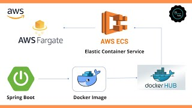

**Important: Don't forget to update the [Candidate README](#candidate-readme) section**

Real-time Transaction Challenge
===============================
## Overview
Welcome to Current's take-home technical assessment for backend engineers! We appreciate you taking the time to complete this, and we're excited to see what you come up with.

You are tasked with building a simple bank ledger system that utilizes the [event sourcing](https://martinfowler.com/eaaDev/EventSourcing.html) pattern to maintain a transaction history. The system should allow users to perform basic banking operations such as depositing funds, withdrawing funds, and checking balances. The ledger should maintain a complete and immutable record of all transactions, enabling auditability and reconstruction of account balances at any point in time.

## Details
The [included service.yml](service.yml) is the OpenAPI 3.0 schema to a service we would like you to create and host.

The service accepts two types of transactions:
1) Loads: Add money to a user (credit)

2) Authorizations: Conditionally remove money from a user (debit)

Every load or authorization PUT should return the updated balance following the transaction. Authorization declines should be saved, even if they do not impact balance calculation.


Implement the event sourcing pattern to record all banking transactions as immutable events. Each event should capture relevant information such as transaction type, amount, timestamp, and account identifier.
Define the structure of events and ensure they can be easily serialized and persisted to a data store of your choice. We do not expect you to use a persistent store (you can you in-memory object), but you can if you want. We should be able to bootstrap your project locally to test.

## Expectations
We are looking for attention in the following areas:
1) Do you accept all requests supported by the schema, in the format described?

2) Do your responses conform to the prescribed schema?

3) Does the authorizations endpoint work as documented in the schema?

4) Do you have unit and integrations test on the functionality?

Here’s a breakdown of the key criteria we’ll be considering when grading your submission:

**Adherence to Design Patterns:** We’ll evaluate whether your implementation follows established design patterns such as following the event sourcing model.

**Correctness**: We’ll assess whether your implementation effectively implements the desired pattern and meets the specified requirements.

**Testing:** We’ll assess the comprehensiveness and effectiveness of your test suite, including unit tests, integration tests, and possibly end-to-end tests. Your tests should cover critical functionalities, edge cases, and potential failure scenarios to ensure the stability of the system.

**Documentation and Clarity:** We’ll assess the clarity of your documentation, including comments within the code, README files, architectural diagrams, and explanations of design decisions. Your documentation should provide sufficient context for reviewers to understand the problem, solution, and implementation details.

# Candidate README
## Bootstrap instructions
In order to run the application, you must first have [Apache Maven](https://maven.apache.org) installed. If you do not, then please go ahead and install it on your machine first. Once you have installed Maven, then you can clone this repository using the method of your choice.

After completing the above, open a terminal and cd into the repository. Now, type the following command:

```
mvn clean package install spring-boot:run
```

This will take a little bit of time, but when you stop receiving output and see "Started Application in X seconds" somewhat near the bottom rightside
of your terminal output, then the service is up and running and you can access the endpoints at "http://localhost:8080/{endpoint}"

## Design considerations

In conceptualizing and developing the service, a focus was placed on delivering both functionality and a robust architecture, emphasizing reliability, scalability, and performance. To achieve these goals, Spring Boot was selected as the framework of choice, renowned for its ability to simplify web service development and abstract tedious tasks like server setup and routing, allowing a concentration on higher-level features.

Embracing a layered design pattern played a crucial role in ensuring scalability and maintainability. A modified Model-View-Controller (MVC) approach was adopted, with distinct controller, service, and repository layers, enabling clear separation of concerns and establishing a foundation for seamless integration of future enhancements.

A meticulous data storage strategy was imperative, taking into account the unique requirements for user and transaction data. For users, an in-memory store was chosen to prioritize quick access and responsiveness. Conversely, SQLite was selected for transactions due to its scalability and transactional capabilities, ensuring persistent and efficient storage.

In addressing currency handling, a flexible solution was devised by storing user balances as currency maps. This approach accommodates multiple currencies without reliance on external conversion rates, preserving flexibility for future enhancements, such as incorporating exchange rate functionality.

Modularity and testability were paramount considerations throughout the design process. Breaking down functionality into granular components enhanced both test coverage and maintenance ease, facilitating seamless addition or modification of features while safeguarding existing functionality.

Moreover, meticulous scoping ensured security and data privacy. Sensitive data was encapsulated within private attributes, with access meticulously controlled via getters and setters, fortifying the service against potential security threats.

In essence, the service's design embodies a meticulous balance of functionality and architecture, leveraging the capabilities of Spring Boot, adhering to best practices, and making informed decisions about data management and security. This approach ensures readiness for both current needs and future growth.

Here is a diagram of the service as well:


## Assumptions

One assumption that I made was that the userId is unique and an identifying element of a User. The service is implemented such that trying to perform loads and authorizations with two different users with the same userId would not be possible. I also assumed that when a load request is passed in for a user and they don't exist yet they should be automatically generated with an overall balance of 0 to start with, essentially abstracting away the user/account creation process.

Another assumption made was that event sourcing should be applied only to the core functionality of the service, essentially only for transactions since that is what was mentioned in the objective (building a transaction history). As such, calls to /ping are not saved as events and user/account management isn't either. 

I also assumed that this service should deal with different currencies itself in some manner but be set up in a way that if additional information is provided, such as conversion rates, user balance could be stored as one singular balance in a chosen currency.


## Bonus: Deployment consideration

Given a service that has a REST API nature such as this one and persists data, most commonly it would be deployed in an environment that can support
these characteristics. Typically, you would deploy a service such as this on the cloud, a VM, or a physical server itself. In particular, if I were to
deploy this service I would first package it using Docker so that its a single container that can be run anywhere which gives me flexibility. Then, depending on my use cases and importance, I can find the best fit for deployment. I would prefer to deploy it on the cloud using platforms such as Google Cloud, AWS, or Azure since they give ease and flexibility in deployment. In particular, I would choose to deploy on AWS using EC2. Observe below:



*This image is not my own creation, it is a thumbnail for a [video](https://www.youtube.com/watch?app=desktop&v=z7_LdCVnCRU).*

## License

At CodeScreen, we strongly value the integrity and privacy of our assessments. As a result, this repository is under exclusive copyright, which means you **do not** have permission to share your solution to this test publicly (i.e., inside a public GitHub/GitLab repo, on Reddit, etc.). <br>

## Submitting your solution

Please push your changes to the `main branch` of this repository. You can push one or more commits. <br>

Once you are finished with the task, please click the `Submit Solution` link on <a href="https://app.codescreen.com/candidate/f0425321-3c8b-49af-91b1-12993bc5950b" target="_blank">this screen</a>.
