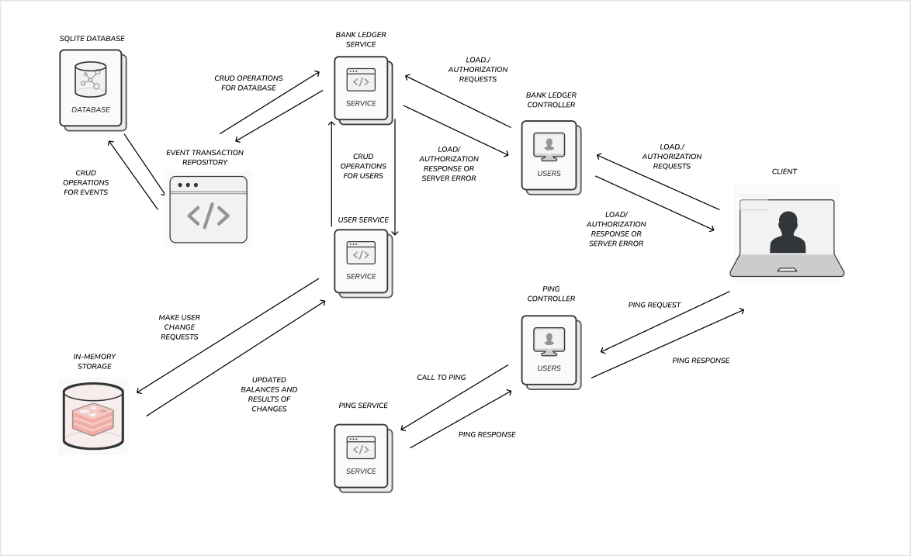

Bank API
===============================
## Overview
This service is a simple bank ledger system that utilizes the [event sourcing](https://martinfowler.com/eaaDev/EventSourcing.html) pattern to maintain a transaction history. The system allows users to perform basic banking operations such as depositing funds, withdrawing funds, and checking balances. The ledger maintains a complete and immutable record of all transactions, enabling auditability and reconstruction of account balances at any point in time.

## Details
The [included service.yml](service.yml) is the OpenAPI 3.0 schema to a service

The service accepts two types of transactions:
1) Loads: Add money to a user (credit)

2) Authorizations: Conditionally remove money from a user (debit)

## Bootstrap instructions
In order to run the application, you must first have [Apache Maven](https://maven.apache.org) installed. If you do not, then please go ahead and install it on your machine first. Once you have installed Maven, then you can clone this repository using the method of your choice.

After completing the above, open a terminal and cd into the repository. Now, type the following command:

```
mvn clean package install spring-boot:run
```

This will take a little bit of time, but when you stop receiving output and see "Started Application in X seconds" somewhat near the bottom rightside
of your terminal output, then the service is up and running and you can access the endpoints at "http://localhost:8080/{endpoint}"

## Design considerations

In conceptualizing and developing the service, a focus was placed on delivering both functionality and a robust architecture, emphasizing reliability, scalability, and performance. To achieve these goals, Spring Boot was selected as the framework of choice, renowned for its ability to simplify web service development and abstract tedious tasks like server setup and routing, allowing a concentration on higher-level features.

Embracing a layered design pattern played a crucial role in ensuring scalability and maintainability. A modified Model-View-Controller (MVC) approach was adopted, with distinct controller, service, and repository layers, enabling clear separation of concerns and establishing a foundation for seamless integration of future enhancements.

A meticulous data storage strategy was imperative, taking into account the unique requirements for user and transaction data. For users, an in-memory store was chosen to prioritize quick access and responsiveness. Conversely, SQLite was selected for transactions due to its scalability and transactional capabilities, ensuring persistent and efficient storage.

In addressing currency handling, a flexible solution was devised by storing user balances as currency maps. This approach accommodates multiple currencies without reliance on external conversion rates, preserving flexibility for future enhancements, such as incorporating exchange rate functionality.

Modularity and testability were paramount considerations throughout the design process. Breaking down functionality into granular components enhanced both test coverage and maintenance ease, facilitating seamless addition or modification of features while safeguarding existing functionality.

Moreover, meticulous scoping ensured security and data privacy. Sensitive data was encapsulated within private attributes, with access meticulously controlled via getters and setters, fortifying the service against potential security threats.

In essence, the service's design embodies a meticulous balance of functionality and architecture, leveraging the capabilities of Spring Boot, adhering to best practices, and making informed decisions about data management and security. This approach ensures readiness for both current needs and future growth.

Here is a diagram of the service as well:



## Deployment

Given a service that has a REST API nature such as this one and persists data, most commonly it would be deployed in an environment that can support
these characteristics. Typically, you would deploy a service such as this on the cloud, a VM, or a physical server itself. In particular, if I were to
deploy this service I would first package it using Docker so that its a single container that can be run anywhere which gives me flexibility. Then, depending on my use cases and importance, I can find the best fit for deployment. I would prefer to deploy it on the cloud using platforms such as Google Cloud, AWS, or Azure since they give ease and flexibility in deployment. In particular, I would choose to deploy on AWS using EC2. Observe below:


*This image is not my own creation, it is a thumbnail for a [video](https://www.youtube.com/watch?app=desktop&v=z7_LdCVnCRU).*
